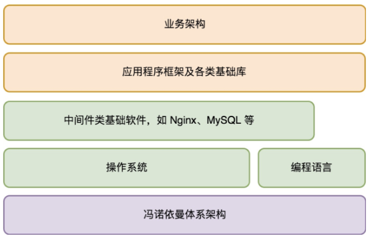
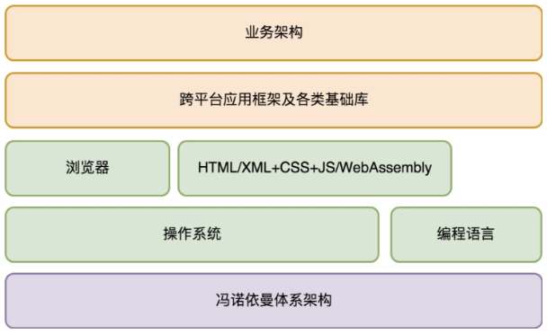

# 架构设计的宏观视角

### 为什么需要建立宏观视角

* 作为架构师，需要的第一个能力是宏观的全局掌控能力
* 作为大厦的架构师，需要把大厦的结构搭建好，让程序员可以把砖填充进去
* 从地基开始，对所依赖的基础架构了解得越全面，做业务架构设计就会越发从容
* 深刻理解基础架构的核心思想是什么，以便可以更好地驾驭它们
* 架构就是分解系统，明确每个子系统（或模块）的规格。架构思维就是分解系统的思考方式（方法论）

### 应用程序的基础架构

* 学习一个程序的基础架构，就是弄清楚电脑的工作原理，以及程序的运行原理
* 基础架构解决的是与业务无关的一些通用性的问题，基础架构通常以独立的软件存在

### 完整的程序架构是怎样的？

* 服务端应用程序的架构体系

* 客户端应用程序的架构体系

> 此文章为 5 月 Day2 学习笔记，内容来源于极客时间[《许式伟的架构课》](http://gk.link/a/122Qp)，强烈推荐该课程！
