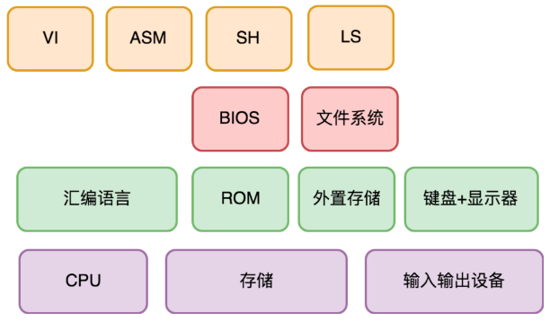

# 如何实现可自我迭代的计算机

### 架构思考题

第一台以键盘 + 显示器为标准输入输出的现代计算机出现后，一个最小功能集，但计算能力可自我迭代的计算机应该是什么样的？

从需求上来说，我们期望它有如下能力：

* 键盘和显示器的驱动程序。当时最主流的外置存储设备（不一定是现代的硬盘）的驱动程序。
* 一个汇编程序编辑器。可从存储中读取汇编程序代码，修改并保存到存储中。一个汇编编译器。
* 可将汇编程序代码编译成机器代码程序，并保存到存储中。
* 支持执行一段保存在外置存储设备中的机器代码程序。

那么，它的变化点和稳定点分别是什么？为此，你会怎么设计，设计出哪些子系统，每个子系统的规格是什么？扩展性上有哪些考虑？

### 怎么实现可自我迭代的计算机

在需求分析时，要区分需求的变化点和稳定点。稳定点往往是系统的核心能力，而变化点则需要对应地去考虑扩展性上的设计。

> 此文章为 5 月 Day6 学习笔记，内容来源于极客时间[《许式伟的架构课》](http://gk.link/a/122Qp)，强烈推荐该课程！
